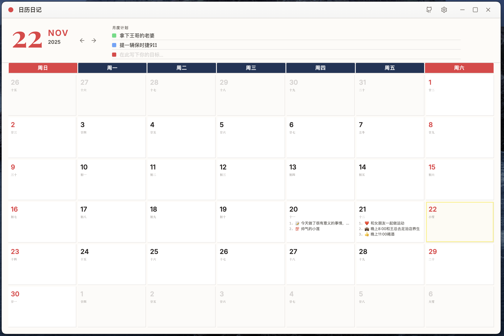
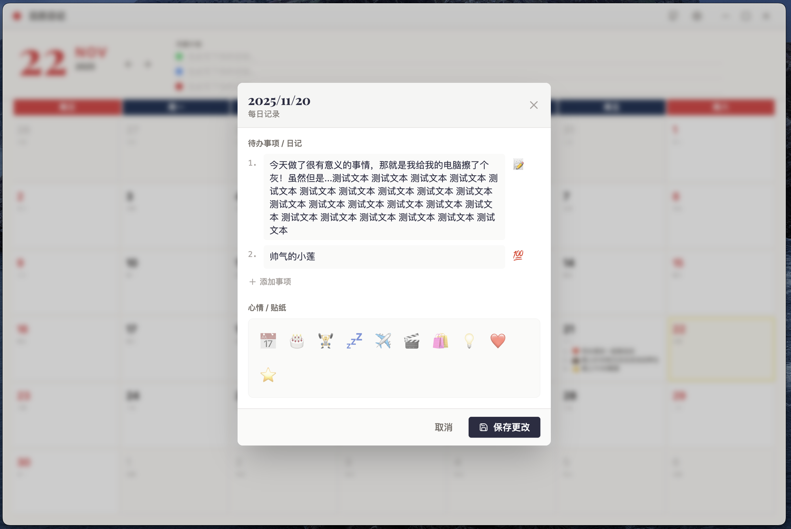

<div align="center">

[简体中文](README.md) | [English](README_EN.md) | [繁體中文](README_TW.md) | [日本語](README_JA.md) | [한국어](README_KO.md) | **Русский**

# 📅 日历日记 · Календарь-дневник

<p align="center">
  
</p>

**Простое и элегантное приложение-календарь для записи повседневной жизни**

[](https://github.com/xiaoxin744/calendar-diary/releases)
[](LICENSE)
[](https://github.com/xiaoxin744/calendar-diary/releases)

[📥 Скачать](#-установка) • [✨ Использование](#-использование) • [🚀 Разработка](#-руководство-по-разработке) • [📝 История изменений](CHANGELOG.md)

</div>

---

## 📖 О приложении

日历日记 — кроссплатформенное приложение календаря-дневника с современным дизайном, предоставляющее пользователям простой и интуитивно понятный опыт записей.

### Скриншоты





### ✨ Основные функции

- **🎯 Простой дизайн** — минималистичный интерфейс, сосредоточенный на контенте
- **📝 Гибкие записи** — поддержка многострочного текста для задач и дневника
- **🎨 Стикеры настроения** — богатая коллекция эмодзи для записи ежедневного настроения
- **📊 Месячный обзор** — понятный календарный макет для обзора всего месяца
- **☁️ Облачная синхронизация** — поддержка WebDAV для синхронизации между устройствами
- **🔐 Защита конфиденциальности** — поддержка PIN-кода и TOTP-аутентификации
- **💾 Локальное хранение** — полностью локальное хранение данных для защиты конфиденциальности
- **🌍 Многоязычность** — упрощённый и традиционный китайский, английский, японский, корейский, русский

## ⭐️ Stars 

[](https://www.star-history.com/#xiaoxin744/calendar-diary&type=date&legend=top-left)

## 🛠️ Технологии

| Технология | Версия | Назначение |
|------------|--------|------------|
| **React** | 19.2.0 | UI-фреймворк |
| **TypeScript** | 5.8.2 | Типобезопасность |
| **Electron** | 39.2.3 | Настольный фреймворк |
| **Vite** | 6.4.1 | Инструмент сборки |
| **Tailwind CSS** | 4.1.8 | Стилизация |
| **date-fns** | 4.1.0 | Работа с датами |
| **Lucide React** | 0.469.0 | Библиотека иконок |
| **webdav** | 5.8.0 | WebDAV-клиент |

## 📥 Установка

### Последняя версия: v0.3.2-beta

Перейдите на страницу [Releases](https://github.com/xiaoxin744/calendar-diary/releases), чтобы скачать пакет для вашей системы:

| Платформа | Тип файла | Описание |
|-----------|-----------|----------|
| 🤖 **Android 8.0+** | `.apk` | Прямая установка; по умолчанию полностью локальная работа без аккаунта и сервера |
| 🪟 **Windows** | `.exe` (NSIS-установщик) | Поддержка выбора пути установки |
| 🪟 **Windows** | `.exe` (Портативная) | Не требует установки |

> В этой предварительной версии доступны пакеты для Android и Windows. Исходный код для macOS, Linux и iOS сохранён и может быть собран в соответствующей системе или среде CI.

### Инструкции по установке

#### Android
1. Скачайте `CalendarDiary-Mobile-0.2.2-android.apk`
2. Откройте APK в файловом менеджере телефона и разрешите установку из этого источника, если появится запрос
3. После установки приложение работает офлайн и подключается к сети только при явной настройке WebDAV

#### Windows
1. Скачайте `CalendarDiary-Setup-0.3.2-beta.exe`
2. Дважды щёлкните для запуска установщика
3. Следуйте мастеру установки

## 📖 Использование

### Основные операции

#### 1️⃣ Просмотр календаря
- При запуске приложение показывает календарь текущего месяца
- Нажмите стрелки для переключения месяцев
- Нажмите на число даты для быстрого перехода

#### 2️⃣ Запись дневника/задач
1. Нажмите на любую ячейку даты
2. Введите содержимое в появившемся редакторе
3. Каждая запись может:
   - 📝 Содержать многострочный текст
   - 😊 Иметь эмодзи-маркер
   - 🗑️ Быть удалена нажатием на иконку удаления
4. Нажмите «Сохранить изменения» для завершения

#### 3️⃣ Добавление стикеров настроения
- Выберите стикеры настроения в нижней части редактора
- Можно добавить несколько стикеров
- Нажмите повторно для отмены выбора

#### 4️⃣ Месячный план
- Записывайте цели на месяц в верхней части календаря
- Поддерживается 3 независимых пункта плана
- Планы сохраняются автоматически

### Расширенные функции

#### 📦 Резервное копирование и восстановление данных

**Экспорт резервной копии:**
1. Нажмите на иконку настроек ⚙️ в правом верхнем углу
2. Выберите «Экспорт резервной копии»
3. Выберите место сохранения, формат имени файла: `paperplan_backup_YYYY-MM-DD.json`

**Импорт резервной копии:**
1. Нажмите на иконку настроек ⚙️ в правом верхнем углу
2. Выберите «Импорт резервной копии»
3. Выберите ранее экспортированный JSON-файл
4. Данные будут восстановлены после подтверждения

#### 🌍 Смена языка
1. Нажмите на иконку настроек ⚙️
2. Выберите язык в выпадающем списке «Язык»
3. Язык сменится мгновенно, перезапуск не требуется

#### 📂 Просмотр расположения данных
1. Нажмите на иконку настроек ⚙️
2. В области «Расположение данных» нажмите «Открыть папку»
3. Система откроет директорию хранения данных

**Пути хранения данных:**
- Windows: `%APPDATA%\CalendarDiary\`
- macOS: `~/Library/Application Support/CalendarDiary/`
- Linux: `~/.config/CalendarDiary/`

#### 🔄 Обновление программы
- Нажмите кнопку «Проверить обновления» на панели инструментов
- При наличии новой версии будет показана информация и ссылка на страницу релиза
- Нажмите на ссылку для перехода на страницу загрузки

#### ☁️ Настройка облачной синхронизации
1. Нажмите на иконку настроек ⚙️
2. Выберите вкладку «Облачная синхронизация»
3. Настройте адрес WebDAV-сервера, путь, имя пользователя и пароль
4. Нажмите «Проверить подключение» для проверки
5. Нажмите на иконку облака на панели инструментов для управления синхронизацией

## 🚀 Руководство по разработке

### Требования

- **Node.js**: 18.x или выше
- **npm**: Входит в состав Node.js
- **ОС**: Windows 10+, macOS 10.13+, Linux

### Клонирование проекта

```bash
git clone https://github.com/xiaoxin744/calendar-diary.git
cd calendar-diary
```

### Установка зависимостей

```bash
npm install
```

### Режим разработки

```bash
npm run dev
```

Это:
1. Запустит Vite dev-сервер (порт 5173)
2. Автоматически запустит Electron-приложение
3. Поддержка горячей замены модулей (HMR)

### Сборка

#### Сборка для всех платформ

```bash
npm run electron:build
```

#### Сборка для конкретной платформы

```bash
# macOS
npm run electron:build:mac

# Windows
npm run electron:build:win

# Linux
npm run electron:build:linux
```

Результаты сборки выводятся в директорию `release/`.

### Архитектура

#### Архитектура Electron
- **Главный процесс** (`electron/main.ts`): Управление окном приложения, файловой системой
- **Процесс рендеринга** (React App): Пользовательский интерфейс и логика взаимодействия
- **Preload-скрипт** (`electron/preload.ts`): Безопасный IPC-мост

#### Хранение данных
Все данные сохраняются в локальной файловой системе:
- **calendar-data.json**: Данные дневника и задач
- **monthly-plans.json**: Данные месячных планов

Расположение хранилища:
- **Windows**: `%APPDATA%\CalendarDiary\`
- **macOS**: `~/Library/Application Support/CalendarDiary/`
- **Linux**: `~/.config/CalendarDiary/`

## 🤝 Руководство по участию

Приветствуется вклад в код, сообщения о проблемах и предложения!

### Создание Issue
- Используйте понятный заголовок, описывающий проблему
- Предоставьте подробные шаги воспроизведения
- Приложите информацию о системе и логи ошибок

### Создание Pull Request
1. Сделайте Fork этого репозитория
2. Создайте feature-ветку: `git checkout -b feature/AmazingFeature`
3. Зафиксируйте изменения: `git commit -m 'Add some AmazingFeature'`
4. Отправьте в ветку: `git push origin feature/AmazingFeature`
5. Откройте Pull Request

## 📄 Лицензия

Этот проект лицензирован под [CC-BY-NC-4.0](LICENSE).

**Разрешено:**
- ✅ Распространение — копирование и перераспространение
- ✅ Адаптация — ремикс, преобразование, создание на основе

**Условия:**
- 📝 Атрибуция — необходимо указать авторство
- 🚫 Некоммерческое использование — не для коммерческих целей

## 🙏 Благодарности

- Иконки: [Lucide Icons](https://lucide.dev/)
- UI-фреймворк: [React](https://react.dev/)
- Настольный фреймворк: [Electron](https://www.electronjs.org/)
- Работа с датами: [date-fns](https://date-fns.org/)

## 📮 Контакты

- **Обратная связь**: [GitHub Issues](https://github.com/xiaoxin744/calendar-diary/issues)
- **Страница проекта**: [GitHub Repository](https://github.com/xiaoxin744/calendar-diary)

---

<div align="center">

**Если этот проект вам помог, поставьте ⭐ Star!**

Made with ❤️ by TrustDev

</div>
